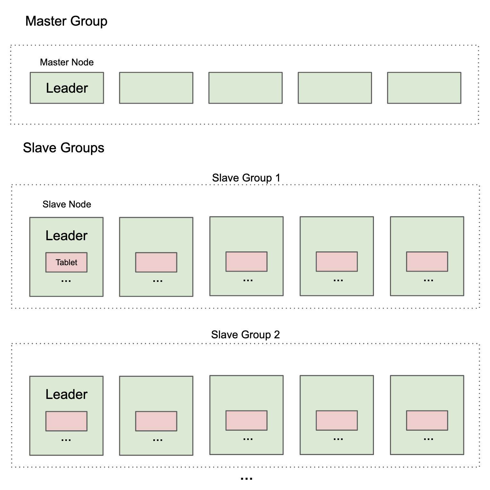

# Table of Contents
- [Table of Contents](#table-of-contents)
- [Introduction](#introduction)
- [Technologies Use](#technologies-use)
- [Getting Started](#getting-started)
- [Supported SQL](#supported-sql)
  - [Basic DDL: CREATE TABLE, ALTER TABLE, DROP TABLE](#basic-ddl-create-table-alter-table-drop-table)
  - [Basic DQL: INSERT, SELECT, UPDATE, DELETE](#basic-dql-insert-select-update-delete)
  - [Basic Aggregations in SELECTs](#basic-aggregations-in-selects)
  - [Table and Column Aliases in SELECTs](#table-and-column-aliases-in-selects)
  - [Correlated Subqueries](#correlated-subqueries)
  - [Common Table Expressions (CTEs)](#common-table-expressions-ctes)
  - [Multi-Stage Transactions](#multi-stage-transactions)
  - [Table Expressions and JOINs](#table-expressions-and-joins)
- [SQL Optimizations](#sql-optimizations)
  - [JOIN Optimization](#join-optimization)
    - [Pushing Down Conjunctions](#pushing-down-conjunctions)
    - [Loading Tables in a JOIN in a Given Order](#loading-tables-in-a-join-in-a-given-order)
  - [Correlated Subquery Optimization](#correlated-subquery-optimization)
- [Core Algorithms](#core-algorithms)
  - [Architectural Overview](#architectural-overview)
  - [Paxos](#paxos)
  - [Paxos2PC](#paxos2pc)
  - [STMPaxos2PC](#stmpaxos2pc)
  - [Region Isolation Algorithm](#region-isolation-algorithm)
  - [Sharding Config](#sharding-config)
- [Currently Unsupported SQL](#currently-unsupported-sql)
  - [Secondary Indices](#secondary-indices)
  - [Table Constraints](#table-constraints)
  - [GROUP BY](#group-by)
  - [ORDER BY \& LIMIT](#order-by--limit)
  - [Set Operations (UNION, INTERSECT, EXCEPT)](#set-operations-union-intersect-except)
  - [Most Aggregation Functions](#most-aggregation-functions)
  - [Most Data Types](#most-data-types)
  - [Subqueries in INSERT statement](#subqueries-in-insert-statement)
  - [Table Aliases and Column Renaming in CTEs and for JOIN Expressions](#table-aliases-and-column-renaming-in-ctes-and-for-join-expressions)
- [Other Limitations](#other-limitations)
  - [Data Persistence](#data-persistence)
  - [Offline Data Cleanup](#offline-data-cleanup)

# Introduction
rUniversalDB is a Distributed Database Management System (DDBMS), similar to Google Spanner and CockroachDB. It is a SQL database, providing ACID transactions. It is distributed, meaning that data is spread across many servers, allowing for virtually limitless horizontal scalability while being fault tolerant. rUniversalDB supports online schema changes, table sharding, and automatic reconfiguration when nodes go down. All of the significant features have at least a basic implementation. However, there is still some SQL we do not support.

# Technologies Use
We use the [`sqlparser`](https://docs.rs/sqlparser/latest/sqlparser/) project for parsing SQL.

# Getting Started
An instance of the system can be deployed locally using docker. First, install docker from the official [website](https://www.docker.com/). To build the docker image, first do a one-time setup:

```sh
./run setup
```

Then, build the docker image:

```sh
./run build
```

Finally, to spin up a toy system locally, do:

```sh
./run start
```

This will start up several nodes locally and it will turn the current shell into an interactive CLI.

To connect to the system and open up a live admin UI in the CLI, type in `live`. This will show you the current database schema, the set of nodes currently in the system, etc., and it will update in real time as those things change. Press `ESC` / `q` to exit the admin UI.

To spin up a new client (in case you are using the original client to view the admin UI), do `./run new_client 3 10` in a new terminal window. Generally, running the command `./run new_client <n> <m>` will start an interactive client, where it will connect to the node `172.20.0.<m>` (which needs to be the Leader of the Master Group) from the IP address `172.20.0.<n>`. 

Finally, you may run any of the below SQL from the interactive CLI. When you are finished, you can shut down and delete all of the docker nodes by doing this:

```sh
./run dclean
```

# Supported SQL

## Basic DDL: CREATE TABLE, ALTER TABLE, DROP TABLE
We have the basic DDL statements for creating, altering, and dropping tables.

```sql
-- Create a table
CREATE TABLE user (
    id INT PRIMARY KEY,
    email VARCHAR,
    username VARCHAR,
    password_hash VARCHAR,
    salary INT,
    is_admin BOOLEAN,
);

-- Add column
ALTER TABLE user ADD COLUMN name VARCHAR;

-- Remove column
ALTER TABLE user DROP COLUMN name;

-- Drop table
DROP TABLE user;
```

## Basic DQL: INSERT, SELECT, UPDATE, DELETE
We support the basic DQL statements to read data from and write data to tables.

```sql
-- Insert rows
INSERT INTO user (id, email, username, password_hash, salary, is_admin)
VALUES
    (1, 'email1@example.com', 'user1', 'pw1', 10, FALSE),
    (2, 'email2@example.com', 'user1', 'pw2', 11, TRUE),
    (3, 'email3@example.com', 'user2', 'pw3', 9, FALSE);

-- Select rows
SELECT *
FROM user
WHERE id = 2;

-- Update rows
UPDATE user
SET username = ''
WHERE id = 2;

-- Delete rows
DELETE
FROM user
WHERE id = 2;
```

## Basic Aggregations in SELECTs
We support aggregating columns in a SELECT statement. Importantly, we do NOT yet support `GROUP BY`, which would allow us to aggregate some columns but not others.

```sql
-- COUNT aggregation
SELECT COUNT(id)
FROM user
WHERE is_admin;

-- DISTINCT
SELECT DISTINCT username
FROM user;

-- DISTINCT inside of an aggregation function
SELECT COUNT(DISTINCT username)
FROM user;
```

## Table and Column Aliases in SELECTs
We can rename the table used in the FROM clause, as well as the names of the columns returned by a SELECT. The renamed elements of the SELECT clause will manifest in the Table View that is returned from running the above SQL. The section on `Common Table Expressions` and `JOINs` will show more examples of when renamed columns are relevant.

```sql
-- Note that as columns are used, we can optionally qualify them with the Table Aliases.
SELECT email AS em, salary * 2 AS double_salary
FROM user AS U
WHERE U.is_admin AND salary > 3;
```

## Correlated Subqueries
Correlated Subqueries are where there is a `SELECT` statement that returns a single table cell located inside of a mathematical expression, where this `SELECT` statement can generally use columns from the outer table.

```sql
-- Notice that the same table can be used in the Correlated Subquery. Table aliases help
-- qualify the column references accordingly.
SELECT email
FROM user as U1
WHERE salary >= (
    SELECT AVG(salary)
    FROM user as U2
    WHERE U1.username = U2.username);

-- Correlated subqueries can happen in UPDATE, and DELETEs as well.
-- In addition, correlated subqueries can go arbitrarily deep.
UPDATE user
SET salary = salary * 2
WHERE salary <= (
    SELECT AVG(salary)
    FROM user as U1
    WHERE is_admin AND 2 = (SELECT COUNT(id)
                            FROM user AS U2
                            WHERE U1.username = U2.username));
```

## Common Table Expressions (CTEs)
Common Table Expressions are essentially temporary tables that are created in the middle of a query that can be used again later on. We use the `WITH` keyword to do this.

```sql
-- Notice how complex the Select clause in the main SELECT statement is; the total
-- set of columns it returns are `(em, em2, em, double_salary, quadruple_salary)`
WITH
    temp_table AS
       (SELECT email AS em, salary * 2 AS double_salary
        FROM user
        WHERE username = 'user1')
SELECT em, em as em2, *, double_salary * 2 AS quadruple_salary
FROM temp_table;

-- Notice the SELECT statement that defines a CTE can itself have CTEs. Notice how
-- we can use temporary tables defined prior in the outer CTEs from within the inner CTE.
WITH
    first_temp_table AS
        (SELECT *
        FROM user
        where salary < 10),
    temp_table_outer AS
       (WITH
            temp_table AS
               (SELECT email AS em, salary * 2 AS double_salary
                FROM first_temp_table AS T
                WHERE T.username = 'user1')
        SELECT em, em as em2, *, double_salary * 2 AS quadruple_salary
        FROM temp_table)
SELECT *
FROM temp_table_outer;
```

## Multi-Stage Transactions
An important capability is the ability to execute multiple SQL statements in a transactional manner. This is particularly important when we want to do multiple writes transactionally. We have this capability.

```sql
-- We can update the same table multiple times, even using it in subqueries. Note that the effects
-- of the first UPDATE will already be observed by the subquery in the second update.
UPDATE user
SET salary = salary + 1
WHERE id = 2;

UPDATE user
SET salary = (SELECT AVG(salary)
              FROM user) + 2
WHERE id = 1;
```

## Table Expressions and JOINs
We have table joins. We generally refer to expressions that can go in the `FROM` clause as "Table Expression", which can generally consist of Derived Tables (i.e. subqueries), tables, and temporary tables from Common Table Expressions, all combined by any manner of joins.

```sql
-- Basic inner JOIN
SELECT *
FROM user AS U1 JOIN user AS U2;

-- We have non-inner JOINs, i.e. LEFT, RIGHT, and FULL OUTER join.
SELECT *
FROM user AS U1 LEFT JOIN user AS U2 ON U1.id = 1;

-- We can nest joins.
SELECT *
FROM user AS U1 JOIN (user AS U2 LEFT JOIN user AS U3 ON U2.id = 1)
WHERE U1.id = 1;

-- We have Lateral Joins. Notice how we also support qualified wildcards.
SELECT U.email, D.*
FROM user AS U JOIN LATERAL (
    SELECT AVG(salary)
    FROM user
    WHERE username = U.username
) AS D;

-- The join leaves can be Derived Tables (which are subqueries in the join leaves), temporary
-- tables, and real tables.
WITH
    temp_table AS
       (SELECT email AS em, salary * 2 AS double_salary
        FROM user
        WHERE username = 'user1')
SELECT T.em, D.*
FROM temp_table AS T RIGHT JOIN (
    SELECT AVG(salary)
    FROM user
    WHERE username = 'user1'
) AS D;

-- We can have subqueries in the ON clauses as well. Notice how in the outer ON clause, the
-- Table Alias U3 is available to reference its columns.
SELECT U1.*, U3.email
FROM user AS U1 JOIN
        (user AS U2 JOIN user AS U3
            ON 1 <= (SELECT COUNT(id)
                     FROM user
                     WHERE username = U2.username AND email = U3.email))
        ON 1 <= (SELECT COUNT(id)
                 FROM user
                 WHERE username = U1.username AND email = U3.email)
WHERE U1.salary < 10;
```

# SQL Optimizations
We have written our system to be as optimal as possible; we try to avoid wasteful work, to use optimized evaluation schemes if the user provides a query that uses the primary key in a way that should theoretically be quick to execute, etc. We discuss these schemes here.

## JOIN Optimization
Joins are optimized in the `optimize_all_levels` function in `query_converter.rs`.

### Pushing Down Conjunctions
Suppose we have another table, called `account`. If we a Join as follows:

```sql
SELECT *
FROM account AS A JOIN user as U
WHERE U.id = 3;
```

Recall that since our database is distributed, the `account` table may be located on one set of servers while the `user` table may be located on a different set of servers. Suppose this `SELECT` is being evaluated on the server containing `account`. Since the WHERE Clause restricts the set of `user` rows that will be used in the ultimate result, our evaluation system will not read in the whole `user` table, but rather only the record with `U.id = 3`. The WHERE clause could also have been `U.id < 4`; we only read in these records from the user table. Note that we would do something similar for ON Clauses as well (although we have to be careful if the Join type is not an inner join (e.g. like a `RIGHT JOIN`))

### Loading Tables in a JOIN in a Given Order
Suppose we have a Join as follows:

```sql
SELECT *
FROM account AS A JOIN user as U ON A.id = U.account_id
WHERE U.id = 3
```

Here, notice that although the `account` and `user` tables can generally be enormous, this query should probably return a relatively small amount of data (i.e. one row), and it should be fairly quick to execute. Ideally, the user with `U.id = 3` should be read from the `user` table (of which there should just be one record), and then the account with `A.id = U.account_id` should be read from the `account` table (of which there should be one record), and these two records should be connected and returned to the caller. This should take at most `log(n)` time complexity, where `n` is the size of the tables. This is exactly what our Join Optimizer is. It will pay attention to predicates like `A.id = U.account_id`, where the Primary Key is on one side of an equality, and then our system will come up with an evaluation plan to minimize the number of data that needs to be read form each table (since such data will often need to be passed over the network, which can be costly).

Our system can generally take a join with multiple nestings, multiple ON/WHERE Clauses, multiple predicates per ON/WHERE Clause (combined using `AND`), and then devise an optimal scheme for evaluation. For instance, suppose there is a `credit_card` table, and consider the following query.

```sql
SELECT *
FROM account AS A JOIN (user AS U JOIN credit_card AS CC)
      ON A.id = U.account_id AND CC.id = A.credit_card_id
FROM U.id = 3
```

Although the various conjunctions seem everywhere, our Join Optimizer will recognized that the way to execute this Join is to first read the user with `U.id = 3`, then the account with `A.id = U.account_id`, then the credit card with `CC.id = A.credit_card_id`, which is optimal in speed and space/network usage.

## Correlated Subquery Optimization
When there is a correlated subquery, we do not fire a separate query containing the SQL of the inner query for every single row in the outer query. Rather, we bundle them up so that there are as few inner queries as possible. Thus, consider the following query:

```sql
SELECT *
FROM user AS U1
WHERE 10 = (
  SELECT COUNT(id)
  FROM user U2
  WHERE U1.age > U2.age
);
```

Suppose `age` is an integer. In the above, even if the `user` table was very large, the number of different inner subqueries that need to be evaluated should not be more than 100 (if we assume that most `age` values are below 100). Our system does exactly this optimization to minimize the amount of work that needs to be done and data that needs to be transferred over the network.

# Core Algorithms
Here, we discuss this high-level architecture of the system, and then discuss some of the core algorithms that were needed in order to make the system work. [This document](https://docs.google.com/document/d/14bBCSwyxvbAby_8fBfFuoKTanpaV1YXoi1MKlBzJxSQ) contains many formalization and proofs of these core algorithms, providing us a strong foundation to have a correct, working system.

## Architectural Overview
The below is a diagram that shows the architecture of our system. Recall that our system is distributed; data is replicated across multiple servers to minimize the possibility of data loss. Servers are grouped into "Paxos Groups", all of which contain the exact same data and are kept in-sync using the Paxos algorithm. In addition to replication, our system is capable of sharding tables, where each shard would be managed by its own Paxos Group. This way, tables can grow arbitrarily large and they have no obligation to fit on a single server. We refer to such a shard as a "Tablet" (a term taken from Google Spanner). At any time, there is a leader for every Paxos Group that performs most of the work for executing transactions that concern all tablets managed by the Paxos Group.

Now, SlaveGroups are the PaxosGroups that are responsible for holding table data. To hold metadata, particularly the database schema, the locations of the Tablets, etc, we have the MasterGroup.

End users can connect with the Leaders of any SlaveGroups and then send it their SQL Queries. Our system is, of course, capable of handling many queries in parallel that generally need to touch many tables, and it takes care of making sure they are executed properly to preserve ACID semantics.

<p align="center">
  
</p>

## Paxos
[This section](https://docs.google.com/document/d/14bBCSwyxvbAby_8fBfFuoKTanpaV1YXoi1MKlBzJxSQ/edit#heading=h.vxi45ten3i0z) presents and proves our implementation of the Paxos Algorithm. For me, the paper that best described the Paxos Algorithm is [this one](http://wwwusers.di.uniroma1.it/~mei/SistemiDistribuiti/Schedule_files/fastpaxosfordummies.pdf). However, there are many other things that a practical implementation needs, like a method to choose and maintain the leader of a Paxos Group, protocols for abandoning an old leader and trying to choose a new leader, protocols to clean up historical Paxos Algorithm instances once all nodes have learned about those old things, being more network-efficient by avoiding sending around the learned value more than it needs be sent (in our implementation, it is primarily only sent once from the leader to all followers, but not across followers as the Paxos Algorithm typically requires), and finally, removing an dead node from a Paxos Group and booting up a new node (i.e. "Reconfiguration"). One of the big challenges is cleaning up algorithm metadata as time goes on (which is something that theoretical algorithms, like Paxos, don't always explicitly account for, perhaps because it is too boring!).

Note that the proof in our paper is actually of a slightly older version of the algorithm that does not account for "Reconfiguration". But there is less hand-waving, so we present it instead.

## Paxos2PC
Often, we need multiple Paxos Groups to collectively perform a write, or to collectively not perform a write, but not for some Paxos Groups to perform it and others to not perform it. A prime example is when writing to a sharded table, where ever shard resides in a distinct Paxos Group. The classical way of solving this problem is using the 2 Phase Commit (2PC) algorithm, but this algorithm only applies when every participant is a single machine, not an entire Paxos Group (which is a group of machines where members can go down, the leader can change at any time, etc).

In an attempt to get 2PC working, where every Resource Manager (RM) and the Transaction Manager (TM) are Paxos Groups, I came up with the Paxos2PC algorithm, which is defined and proven in [this section](https://docs.google.com/document/d/14bBCSwyxvbAby_8fBfFuoKTanpaV1YXoi1MKlBzJxSQ/edit#heading=h.8t3rbukhugaj). In an attempt to be performant, this algorithm only requires one round of Paxos consensus to be performed before the Transaction Manager will know whether the 2PC was successful or not. This single Paxos Consensus only happens in each RM. Importantly, the TM does *not* need to do Paxos Consensus. This is an important optimization for latency, since Paxos Consensus requires cross-datacenter communication (whereas most other network communication in our system does not), and so only having one execution of it will reduce latency significantly (in comparison to having multiple executions of it).

We need to use Paxos2PC to finish the execution of any SQL transaction that involves a write, so it is a very important algorithm.

## STMPaxos2PC
Sometimes, we want to execute Paxos2PC, except we *do* want the TM to persist some data of its own into the **Paxos Log** (i.e. the sequence of messages that are replicated across a Paxos Group using the Paxos algorithm). [This section](https://docs.google.com/document/d/14bBCSwyxvbAby_8fBfFuoKTanpaV1YXoi1MKlBzJxSQ/edit#heading=h.4ui6qxcqhoxb) describes a variant of the Paxos2PC algorithm that does this, which we call the Stateful TM Paxos2PC, or STMPaxos2PC, Algorithm.

This algorithm is needed primarily when the Master Group needs to update its metadata (e.g. the Table Schema for when the user adds a column) together with the Slave Groups. Both the Master and all Slaves must succeed, or all must fail with the update.

## Region Isolation Algorithm
The Region Isolation Algorithm is what we used to do concurrent transactions. [This section](https://docs.google.com/document/d/14bBCSwyxvbAby_8fBfFuoKTanpaV1YXoi1MKlBzJxSQ/edit#heading=h.kp7yhdqcrm5) defines and proves the algorithm formally. Here, we essentially define a way of coordinating the execution of concurrent reads/writes in a system consisting of multiple nodes (each containing a distinct set of Tablets (which,recall, is a single shard of a Table)) so that the results of every read are essentially idempotent (despite the fact that writes to the same table cells might be happening concurrently). In a [later section](https://docs.google.com/document/d/14bBCSwyxvbAby_8fBfFuoKTanpaV1YXoi1MKlBzJxSQ/edit#heading=h.11bs0sfhffoi), we actually prove that the Region Isolation Algorithm ensures that there exists an order for the reads/writes such that if they were executed one-by-one serially on a simple database (i.e. one consisting of tables, where the table cells are not version or anything), a process that we call **Flat Replay**, then the results of the reads are the same during the Flat Replay as the concurrent execution. In other words, this later section proves serializability of the read/write coordination scheme presented in the Region Isolation Algorithm.

Important, the Region Isolation Algorithm also has provisions that essentially prevent deadlocks. We simply backoff when the read/write detects that it could possibly be in a deadlock, which only happens if it is trying to read/write to a node at a Timestamps that is exactly the same as the timestamp of another read/write at that node.

## Sharding Config
[This section](https://docs.google.com/document/d/14bBCSwyxvbAby_8fBfFuoKTanpaV1YXoi1MKlBzJxSQ/edit#heading=h.yywqe59pvth7) extends the Region Isolation Algorithm for the case where a Tablet is split into two during the middle of an execution, and then proves that the results of execution are the same as the **Flat Replay**.

# Currently Unsupported SQL
In the interest of time, we punted on some SQL features, and simply did not get around to implementing others. Here, we discuss these limitations and propose solutions to implement them.

## Secondary Indices
Probably the biggest feature we do not support are table Secondary Indices. Note that we *do* support Primary Indices, i.e. tables with a primary key (in fact, all tables must have a primary key). However, we cannot do something like `CREATE INDEX ON user(email)`.

Fortunately, our work with Multi-Stage Transactions makes supporting Secondary Indices fairly straightforward. Secondary Indices will be structured similar to regular tables, and the process of using them to accelerate a read or a write to a table will reduce to just having a Multi-Stage Transaction that reads and writes to the table and all of its Secondary Indices.

## Table Constraints
The second biggest feature we do not support are table constraints. This includes Column Constraints, like `UNIQUE` (besides the Primary Key), `NOT NULL`, and `DEFAULT`. I believe support for `UNIQUE` can be added by simply creating an index on the unique columns.

We also do not yet support Foreign Key Constraints either. I believe Foreign Key Constraints can be added in a rather straightforward manner by always checking the integrity of a Foreign Key by using a Multi-Stage transaction.

## GROUP BY
Some common SQL in SELECT statements that we do not support is `GROUP BY`. Recall that we have rudimentary support for [aggregations](#basic-aggregations-in-selects), but all items that appear in the Select clause must be aggregated because we do not support `GROUP BY`, which would allow us to list out some columns that we do not want to aggregate over.

## ORDER BY & LIMIT
We also do not yet support `ORDER BY` & `LIMIT`, although I believe an initial implementation is fairly easy to add.

## Set Operations (UNION, INTERSECT, EXCEPT)
We currently do not support set operations, which normally allows us to combine the results of multiple SELECT statements. For instance, `UNION` would take the union of the sets of rows, `INTERSECT` would take the intersect, and `EXCEPT` would take the difference.

I believe adding support for this is also fairly straightforward. We can imagine placing the results of every constituent SELECT statement into temporary tables in a Common Table Expressions, and once all results are in, we simply apply the set operations. Since CTEs are already supported, this strategy is not much work.

## Most Aggregation Functions
We currently only support `COUNT`, `SUM`, and `AVG`. We only support this small subset for simplicity; other aggregation functions, like `MAX`, should be fairly straightforward to add support for.

## Most Data Types
We currently only support 3 data types: `INT`, `VARCHAR`, `BOOLEAN`. We only support these types for simplicity; many of the other types, like `FLOAT`, should be straightforward to add support for.

## Subqueries in INSERT statement
Right now, an INSERT statement cannot have an element in the `VALUES` clause be a subquery, or for the whole `VALUES` clause be a subquery itself (generally containing CTEs). We did this for expedience; there should be no challenge for adding this feature.

## Table Aliases and Column Renaming in CTEs and for JOIN Expressions
Generally, we should be able to do things like `FROM (T1 JOIN T2) AS T(c1, c2)`, which should create new names for the columns returned by `T1 JOIN T2`, where the name `T` is now what must be used to qualify these column names. We currently do not support this. In addition, when defining a CTE, we should be able to do `WITH v1(c1, c2) AS ...`, but we also do not support this. Generally, these features should be easy to support by transforming such queries into equivalent queries that does not rename the columns this way. We do such things in the `query_converter.rs`.

# Other Limitations

## Data Persistence
We do not currently persist data on disk; all table data is stored in memory in a map data structure. We did this for expedience; it is not hard to create a basic implementation of persistence using an embedded key-value store, like RocksDB.

In order to use RocksDB, note that more work is required than simply substituting the key-value store in place of the map data structure, since reading/writing from disk will have significant latencies associated with it. To handle this, reads and writes will need to be done asynchronously so that the thread does not block on any individual read/write, but rather does other work in the meantime. Fortunately, our code is already designed such that a thread is juggling many transactions concurrently, which is necessary performing subqueries, acquiring locks, etc.

## Offline Data Cleanup
The way that we do transaction processing is using Multi-Version Concurrency Control (MVCC). Here, table cells do not just contain a single value. Rather, they contain a list of `(value, timestamp)` pairs, where the `timestamp` is the time that the `value` was written. This way, an update or delete to a table cell is just a new value at a more recent time. By remembering historical versions of a table cell, we can have complex read and write queries happening at the same time (as long as the write's timestamp is after the read's) and still have the read query read a consistent snapshot of data.

One problem with MVCC is that we need extra logic to safely delete old versions of the data (to avoid running out of memory/disk). Although our system does not have this logic yet, it is simply a matter of having every Tablet keep track of the minimum timestamp for which it is willing to service a query for. Older versions of data with a timestamp prior to this can simply be removed.
